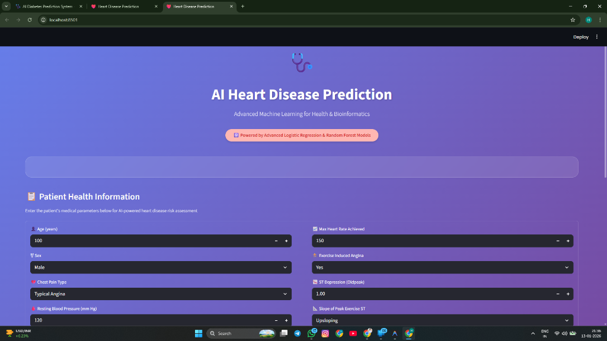

# ❤️ Heart Disease Prediction (Advanced)

An advanced Machine Learning application to predict the likelihood of heart disease using **Logistic Regression, Random Forest, and XGBoost**. The system selects the best model for accurate predictions.



## 📂 Project Structure
```
Heart-Disease-Prediction/
├── app.py                      # Main app (Streamlit UI)
├── model.py                    # Advanced ML training (RF / XGBoost)
├── heart.csv                   # Heart disease dataset
├── heart_model.pkl             # Trained & saved best model
├── scaler.pkl                  # Feature scaler (StandardScaler)
├── requirements.txt            # Project dependencies
└── README.md                   # Project documentation
```

## 🚀 How to Run

### 1. Install Dependencies
```bash
pip install -r requirements.txt
```

### 2. Train the Model
Run the training script to process data, train models, and save the best one.
```bash
python model.py
```
*This will generate `heart_model.pkl` and `scaler.pkl`.*

### 3. Run the App
Start the Streamlit web application.
```bash
streamlit run app.py
```

## 📊 Models Used
- **Logistic Regression**: Baseline linear classifier.
- **Random Forest**: Ensemble learning method for high accuracy.
- **XGBoost**: Gradient boosting for advanced performance.

The script `model.py` automatically evaluates all three and saves the best performer.

## 🖥️ UI Features
- **User Input Form**: Enter health parameters like Age, BP, Cholesterol, etc.
- **Real-time Prediction**: Returns "High Risk" or "Low Risk".
- **Risk Probability**: Shows the confidence percentage of the prediction.

## 📝 Dataset
The project uses the standard **Heart Disease Dataset** (Commonly UCI/Kaggle) containing parameters like:
- Age, Sex
- Chest Pain Type (cp)
- Resting Blood Pressure (trestbps)
- Cholesterol (chol)
- Fasting Blood Sugar (fbs)
- Resting ECG (restecg)
- Max Heart Rate (thalach)
- And more...

---
*Built with ❤️ using Streamlit & Scikit-Learn*
